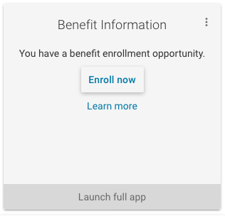
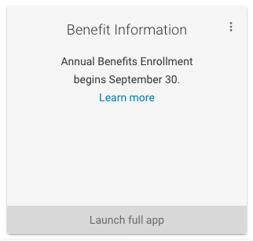
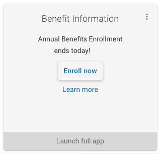
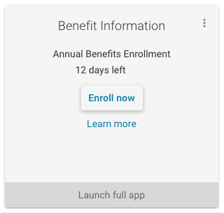
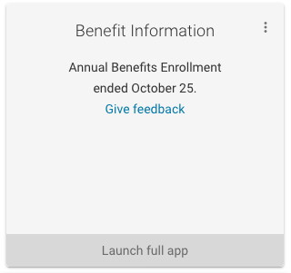
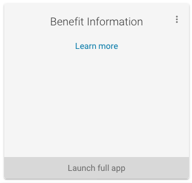

# Benefit Information widget

The Benefit Information Portlet includes a resource URL implementing the Benefit Information widget as a remote-content type widget.

This widget supports Annual Benefits Enrollment.

The `AnnualBenefitEnrollmentDatesService` (sic)
[encodes the dates for Annual Benefits Enrollment][AnnualBenefitEnrollmentDatesService]
and provides a handy API for understanding the meaning of these dates.

The `BenefitInformationController` [implements the logic for the widget][BenefitInformationController benefitInformationWidget method].
The controller dispatches to a view, passing along a model it builds up.

JSPs implement the views for this widget.

## Widget states with example screenshots

Here are the widget states with example screenshots.

The first of these states that applies will display.

## New hire benefits enrollment opportunity

Users with the MyUW HRS Portlets role `ROLE_VIEW_NEW_HIRE_BENEFITS`
see the `benefitInformationWidgetPersonalEnrollmentEvent`
[view][benefitInformationWidgetPersonalEnrollmentEvent JSP].

## Foreshadowing Annual Benefits Enrollment

If the `AnnualBenefitEnrollmentDatesService` believes that it is currently the
right time to foreshadow Annual Benefits Enrollment,
the viewing user will see
the `benefitInformationWidgetAnnualEnrollmentForeshadowing`
[view][benefitInformationWidgetAnnualEnrollmentForeshadowing JSP].

## Last day of Annual Benefits Enrollment for eligible users

If the viewing user has the role `ROLE_VIEW_OPEN_ENROLL_BENEFITS`
and the `AnnualBenefitEnrollmentDatesService` believes that it is the last day
of Annual Benefits Enrollment,
the viewing user will see
the `benefitInformationWidgetAnnualEnrollmentLastDay`
[view][benefitInformationWidgetAnnualEnrollmentLastDay JSP].

**Note that otherwise eligible users lose the `ROLE_VIEW_OPEN_ENROLL_BENEFITS`,
typically overnight, after exercising their annual benefit enrollment
opportunity.**

## During ABE for eligible people

If the viewing user has the role `ROLE_VIEW_OPEN_ENROLL_BENEFITS`
and the `AnnualBenefitEnrollmentDatesService` believes that it is during the
Annual Benefits Enrollment period but not the last day of that period,
the viewing user will see
the `benefitInformationWidgetAnnualEnrollmentDuringCountdown`
[view][benefitInformationWidgetAnnualEnrollmentDuringCountdown JSP].

**Note that otherwise eligible users lose the `ROLE_VIEW_OPEN_ENROLL_BENEFITS`,
typically overnight, after exercising their annual benefit enrollment
opportunity.**

## Feedback period after annual benefits enrollment

If the `AnnualBenefitEnrollmentDatesService` believes that it is during the
ABE feedback period, the viewing user will see
the `benefitInformationWidgetAnnualEnrollmentFeedback`
[view][benefitInformationWidgetAnnualEnrollmentFeedback JSP].

## Default Benefit Information widget

If none of the above cases applies,
the viewing user will see
the `benefitInformationWidget`
[view][benefitInformationWidget JSP].

[AnnualBenefitEnrollmentDatesService]: https://github.com/UW-Madison-DoIT/hrs-portlets/blob/uw-master/hrs-portlets-api/src/main/java/edu/wisc/hr/service/benefits/AnnualBenefitEnrollmentDatesService.java
[BenefitInformationController benefitInformationWidget method]: https://github.com/UW-Madison-DoIT/hrs-portlets/blob/uw-master/hrs-portlets-webapp/src/main/java/edu/wisc/portlet/hrs/web/benefits/BenefitInformationController.java#L165

[benefitInformationWidgetPersonalEnrollmentEvent JSP]: https://github.com/UW-Madison-DoIT/hrs-portlets/blob/uw-master/hrs-portlets-webapp/src/main/webapp/WEB-INF/jsp/benefitInformationWidgetPersonalEnrollmentEvent.jsp
[benefitInformationWidgetAnnualEnrollmentForeshadowing JSP]: https://github.com/UW-Madison-DoIT/hrs-portlets/blob/uw-master/hrs-portlets-webapp/src/main/webapp/WEB-INF/jsp/benefitInformationWidgetAnnualEnrollmentForeshadowing.jsp
[benefitInformationWidgetAnnualEnrollmentLastDay JSP]: https://github.com/UW-Madison-DoIT/hrs-portlets/blob/uw-master/hrs-portlets-webapp/src/main/webapp/WEB-INF/jsp/benefitInformationWidgetAnnualEnrollmentLastDay.jsp
[benefitInformationWidgetAnnualEnrollmentDuringCountdown JSP]: https://github.com/UW-Madison-DoIT/hrs-portlets/blob/uw-master/hrs-portlets-webapp/src/main/webapp/WEB-INF/jsp/benefitInformationWidgetAnnualEnrollmentDuringCountdown.jsp
[benefitInformationWidgetAnnualEnrollmentFeedback JSP]: https://github.com/UW-Madison-DoIT/hrs-portlets/blob/uw-master/hrs-portlets-webapp/src/main/webapp/WEB-INF/jsp/benefitInformationWidgetAnnualEnrollmentFeedback.jsp
[benefitInformationWidget JSP]: https://github.com/UW-Madison-DoIT/hrs-portlets/blob/uw-master/hrs-portlets-webapp/src/main/webapp/WEB-INF/jsp/benefitInformationWidget.jsp
